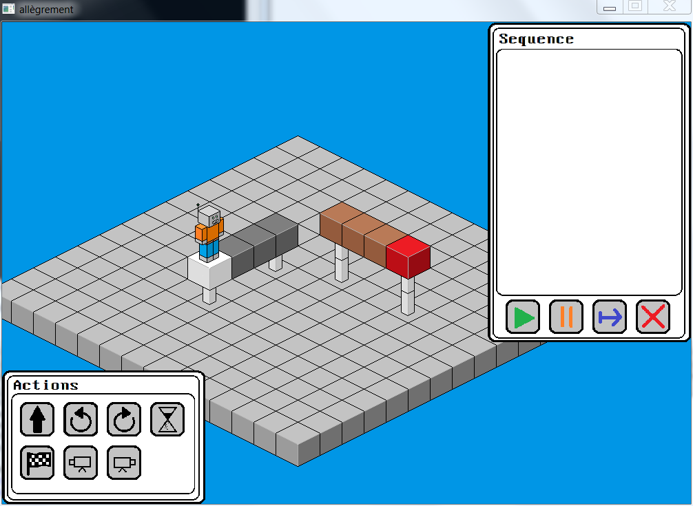
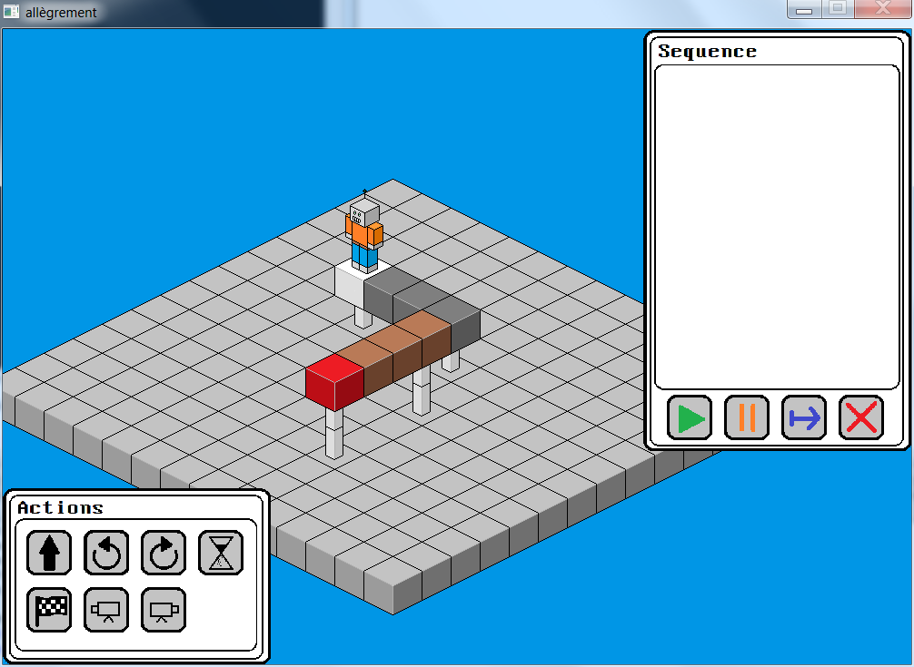
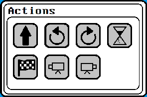
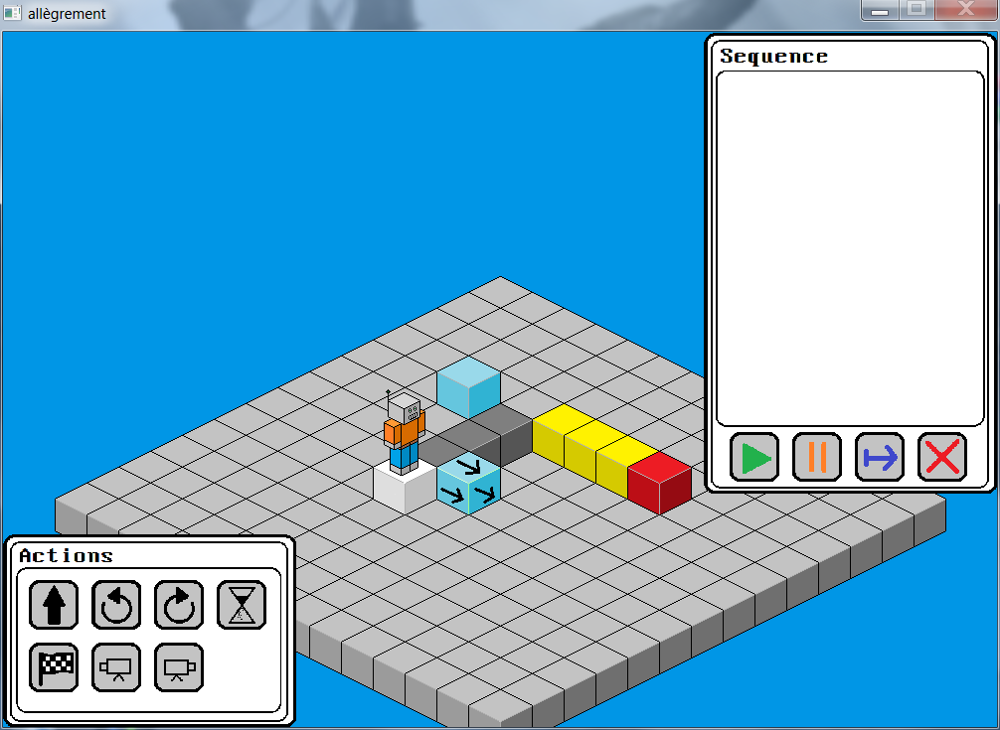
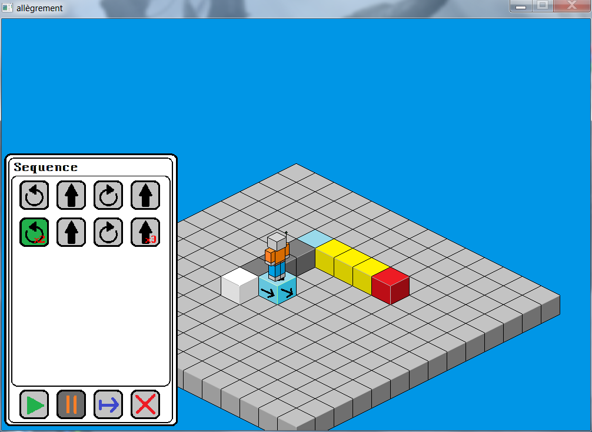
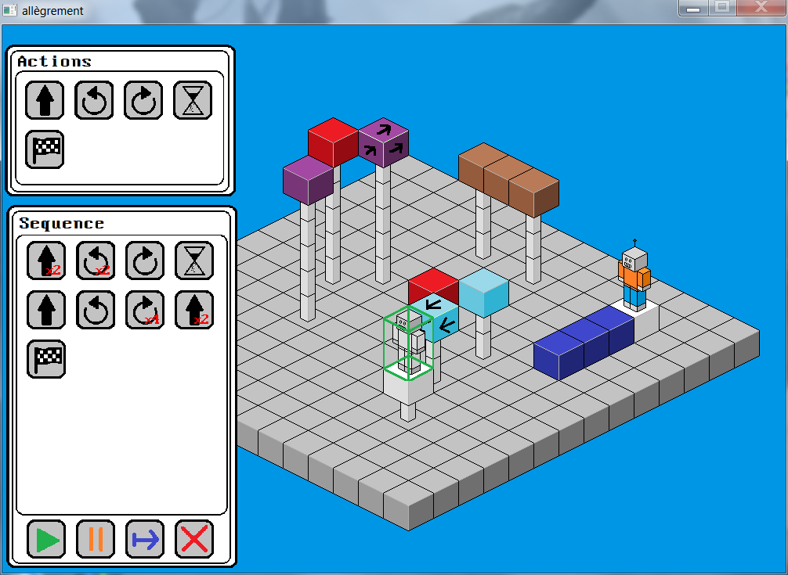
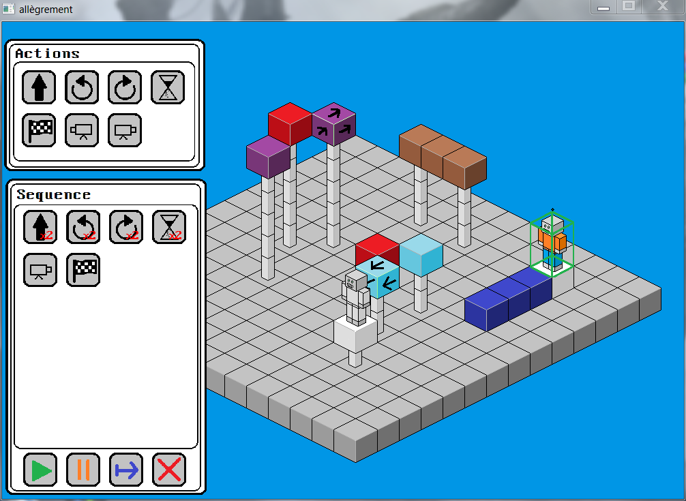
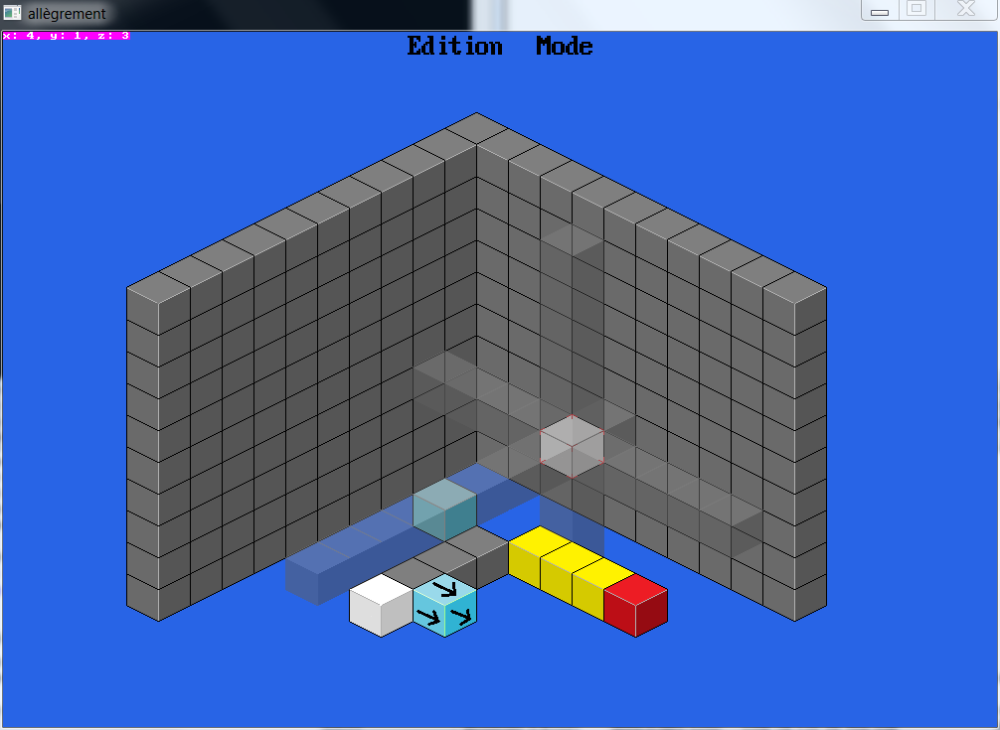
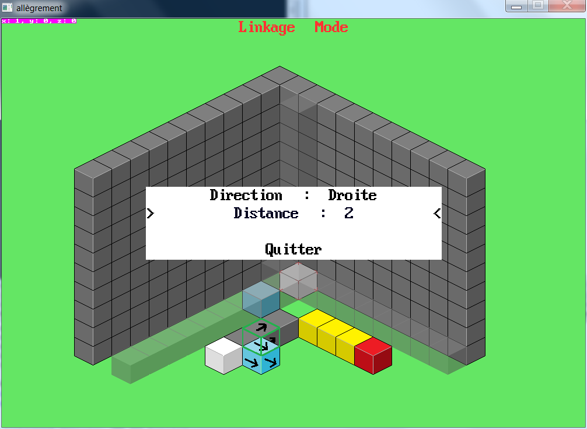

# The project 

I made this project in 2017 during the first year of my engineering school. We had to make a game about controlling a character or an object using predfined movements that you had to place in the right order in order to finish a level. 

The goal of this project was to become more familiar with C, pointers, and the use of the library [allegro](https://liballeg.org/), a 2D graphics library for C that handle sprites, text and basic geometrical shapes display.

# Run instructions

This program needs the library [allegro 4.2](https://liballeg.org/old.html#allegro-4.2-source-releases) to be installed in order to work. Good luck with that.

You can run `make` at the root of the directory if you have a c compiler installed, or you can open the project with an IDE like `Code Blocks` on Windows with an integrated C compiler.

# Isometric perspective

I had already made games in 2D and wanted to discover a new field while making this project, so I chose to use an [isometric perspective](https://en.wikipedia.org/wiki/Isometric_video_game_graphics). It's a 2D method of rendering that enable to fake a third dimention. It is limited in some ways but it's used in many video games, especially old ones where it was a nice way to have an impression of 3D with a limited processing power.

Also, one aspect of isometric rendering is the absence of depth: even if the brain can understand the perspective of a level in isometric view, sometimes it's rather difficult to evaluate the distance of two objects and this can lead to optical illusions. For instance, you could see two apparently adjacent blocks and would try to walk from one to the other while they are in fact on different axis making that move impossible.

I used this exact behaviour in my game where I make those impossible moves possible so you'll have to find the right perspective where two distant blocks touch in order to go from one to the other. This is only possible because our rendering angle is very limited in isometric view and hides the fact that the character jumps from one part of the level to another.

In this image you can see that it may seem impossible to go to the end of the level (in red) because of the gap :

But with the right perspective, it becomes possible :

# Actions and goal

The availables actions are the following :

- **Move forward**
- **Turn Left**
- **Turn Right**
- **Wait**
- **Finish**
- **Rotate perspective 90° left**
- **Rotate perspective 90° right**

The player will have to build a sequence using these actions and the sequence manager. Then, he can play the level and the character will execute the actions in the order chosen by the player and if it leads in the character playing the _Finish_ action on the finishing block, the level is won.

# Special features

## Moving blocks

There is one type of special block that is represented by a very poorly designed arrow in Microsoft Paint. When the player steps on it, all the blocks that have the same color will move in the direction of the arrow. 

This increase the complexity of some level and ask for more patience and reflexion. Here is an illustration of this bloc's behaviour :

 

## Multiple characters

In addition, I implemented multi-character support : while creating a level, you can setup as many character as you want (but must have the same number of finishing blocks) and the game will automatically give each character its own sequence manager and the player will have to create the right sequence for each one of them in order to finish the level :

# In-game Editor

I knew that creating a 3-dimensional game rendered in 2D isometric view would make the level design difficult, so the first thing I started to do was to implement an editor that would allow me to create and edits my levels rapidly.

In this editor, there are two walls delimiting the boundaries of the back of the level, and semi-transparents lines of blocks that help locating the selection location in 3D, which can be misleading as stated above.

 
Also, I needed to add a special _Linkage Mode_ for the Moving blocks. You could enter this mode while on any block in order to set it as a _Linker Block_ and then select all the blocks that should move when the player steps on it, as well as their direction and the distance they should move :
 

